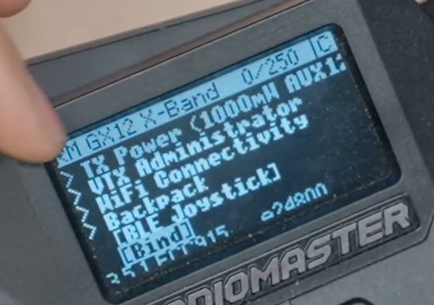
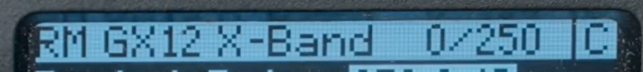

# CRASH LOG

## Bind

1. On Radio: Long press:'Sys' > Tools => Express LRS

bk

1. Find and Select [Bind].

1. Put Receiver into Bind Mode by Unplugging and Plugging 3x.  

<!-- Receiver LED Status Table -->

| LED Indication                                                                          | Status                                              |
|-----------------------------------------------------------------------------------------|-----------------------------------------------------|
|  &nbsp;&nbsp; Solid on | Connected to a transmitter, or bootloader mode enabled |
|  &nbsp;&nbsp; Double blink       | Binding mode enabled                                |
| Slow blink 500ms   | Waiting for connection from transmitter            |
| Triple blink       | Connected to transmitter but mismatched model-match configuration |
| Medium speed       | Radio chip not detected                            |
|  &nbsp;&nbsp; Fast blinking      | WiFi mode enabled                                  |

<!-- End Table -->

::: {note}
:class: custom-blue

Receiver will enter WIFI state after one minute.
:::

  

 

 

- "C" in the upper right hand corner denotes a successful BIND.

::: {note}
:class: custom-blue

Audio: "Telemetry Recovered"
:::

:::{tip}
This is a tip admonition.
:::

:::{warning}
This is a warning admonition.
:::

::: {card}

  

  <u>[Bind](https://www.youtube.com/watch?v=N0ajKoef3qs)</u>

:::

## Header
