# Donut Tutorial

## Part 01: The Basics

[Navigation and Hotkeys](Hotkeys.md)

**Object Mode, Edit Mode**  
Blender has two different modes to work in.  
Each mode has restrictions on what commands can be delivered.   
ie. 'X' to delete, works different in Object Mode vs. Edit Mode. 
Edit mode is only available when an object is selected.  

#### Change Resolution Scale of Interface.
* Edit > Preferences > Interface > Resolution Scale.


---

#### Change Material Colors

Material color changes are not interactive and only show when rendered (F12).

% https://www.dropbox.com/s/d0tgmotsvrxbr4y/01_B-ChangeMaterialColors.mp4?raw=1

<style>
  video {
    width: 100%;
  }
</style>

<video controls>
  <source src="https://www.dropbox.com/s/d0tgmotsvrxbr4y/01_B-ChangeMaterialColors.mp4?raw=1" type="video/mp4">
</video>

---

```{note} **Collections** are the equivalent to Folders.
:class: warning

```  

% PART TWO--------------------------------------

## Part 02: Object Editing

**Object Editing**

| Command |  Hotkey      | 
| ------- | -----------   | 
|Add                 | Shift + A|
| Recall 'Operator Presets'| F9 | 

<style>
   video {
    width: 100%;
  }
</style>

<video controls>
<source src='https://www.dropbox.com/s/uqgtstm8ht4axa5/02_A-CreateTorus.mp4?raw=1'>
</video>


```{note}
:class: warning
- Having an even number seams can help when unwrapping for UV's or performing slices.  
- Odd may be helpful when trying to define the middle of an object.
```  

<style>
  video {
    width: 100%;
  }
</style>
 
 Here we learn to 'Apply Scale'.

| Command |  Hot Key   |
| ------- | -----------|
| Apply Scale | Ctrl + A  |
|Open Item Panel | N |

<video controls>
<source src='https://www.dropbox.com/s/8ky3l3e0t0lf6mp/02_B-Apply-Scale.mp4?raw=1'>
</video>

Here we scale the donut down from 3m to ~ 9 cm. 
The scale should always be near to 1, 1, 1. 

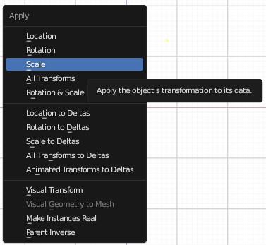

[Blender Guru: Tutorial 02, Apply Scale](https://youtu.be/imdYIdv8F4w?t=454)

We can change the shading of our object by **Selecting** the object and right clicking over the background.  
"Smooth shade is an illusion. It does not add any geometry."

 | Mouse |  Smooth Shade      |
 | ------- | -----------   | 
 |**RMB over background** | |


### Camera Lessons

| Command | Hot Key   |note|
| ------- |-----      |---|
|1. Look Thru Camera| Numpad - 0   | toggles between camera and perspective view |

<style>
  video {
    width: 100%;
  }
</style>
 
<video controls>
<source src='https://www.dropbox.com/s/537qup8eaq9e2t7/02-E_Camera-Look-Through.mp4?raw=1'>
</video>

---

| Command | Hot Key     | note |
| ------- | ---------- |----  |
| 3. Select Donut| |
| 4. Frame Selection | Press Numpad - Period ' . ' |
| 5. Move Camera to Perspective View  | Ctrl + Alt + Numpad - 0 | _**Extremely Useful Hot Key**_ |


<style>
  video {
    width: 100%;
  }
</style>
 
<video controls>
<source src='https://www.dropbox.com/s/cs84e7iomn36d1c/02-Eb_Camera-Ctrl-Alt-Num-0.mp4?raw=1'>
</video>

The camera snaps to the donut's position. 

---
**Simple Way to Frame a Shot**

| Command | Hot Key     | note |
| ------- | ------------|-----|
| Side Menu  | N |
| View | Select |
| Activate 'Camera to View'  | Blue Checkbox |
| Set Desired Camera Frame | Pan, Rotate, Zoom |
| Deselect 'Camera to View' | | Or we can leave on and press Numpad '0' to exit |


---

**Complex Way to Frame a Shot**
| Command | Hot Key   |note|
| ------- |-----      |---|
| **Move Camera Frame** |    |
| 1. Select Camera Frame |    | Notice in right hand view, camera turns orange |
| 2. Activate Grab Tool | G |
| 3. Enter Smooth Zoom Mode  | Depress MMB | In perspective view, we hold Ctrl + MMB to smooth Zoom |

<style>
  video {
    width: 100%;
  }
</style>
 
<video controls>
<source src='https://www.dropbox.com/s/kach3hb5jypsj2i/02-Eb-ii_Camera-G-MMB-Drag-to-Zoom.mp4?raw=1'>
</video>

---

| Command | Hot Key     | note |
| ------- | ---------- |----|
| 4. Activate Grab Tool | G | With frame selected |
|5. Move Camera | LMB |    |
|6. Engage Smooth Zoom | G + MMB | We add a smooth zoom at the end |

<style>
  video {
    width: 100%;
  }
</style>
 
<video controls>
<source src='https://www.dropbox.com/s/gzk0t3d25l4f7d1/02-Ec_Camera-G-Drag-to-Move.mp4?raw=1'>
</video>

| Command | Hot Key     | note |
| ------- | ------------|-----|
| 7. Render Camera View | F12 | Check view by rendering |

<style>
  video {
    width: 100%;
  }
</style>
 
<video controls>
<source src='https://www.dropbox.com/s/9t42wevpkevzqt7/02-Ed_Render-Camera-View.mp4?raw=1'>
</video>

---

<div class="subd">

### Subdivision
Also known as "subd's, subds, subsurf, subsurfaces". 
- Subdivisions are a way to smooth our models while still maintaining control over their base wire frame / cage.  
- Subdivisions are typically added in object mode, but we can select the option to view the results in Edit mode.  
- We can toggle the visibility of the Subd's for the viewport and the render.

<style>
  video {
    width: 100%;
  }
</style>
 
<video controls>
<source src='https://www.dropbox.com/s/57d6ugx6nsab8pj/02-F_Subdivision-Catmull.mp4?raw=1'>
</video>

---
| Hot Key | Pie Menu |
| ------ | -------- |
| <td style="text-align: center">Select **Mode** </td> | | 
|  Ctrl + Tab |     |   

---

### Proportional Editing

| Command | Hot Key     | note |
| ------- | ------------|-----|
| Proportional Grab | Select ( Vertice, Edge, Face ) + O + G + Scroll MMB Up | Activate 'O' Before 'G' |

<style>
  video {
    width: 100%;
  }
</style>
 
<video controls>
<source src='https://www.dropbox.com/s/o9hojjowi7o20hx/Hot_Key_O-Proportional-Edit.mp4?raw=1'>
</video> 

---

### Scale Along Normals

| Command | Hot Key     | note |
| ------- | ------------|-----|
| Move Along Normals | Alt + S |

<style>
  video {
    width: 100%;
  }
</style>
 
<video controls>
<source src='https://www.dropbox.com/s/7s8pohvu2id511u/Hot-Key_Alt-S-Scale-Along-Normals.mp4?raw=1'>
</video>

---

% PART 03 ---------------------

## Part 03: Modifiers

Create a Layer for Icing.

### Separate by Selection

| Command |  Hot Key    | note |
| ------- | -----|--|
| Wireframe | Alt + Z | | Select backfacing vertices |
| Duplicate | Shift + D| 'esc' to drop selection back in place |
| Separate | P [Selection] | A Separate Layer Occurs |

<style>
  video {
    width: 100%;
  }
</style>
 
<video controls>
<source src='https://www.dropbox.com/s/62n03gmfmbmhio2/03-A_Duplicate-Separate-P.mp4?raw=1'>
</video>

---

### Modifier: Solidify

Apply a the Solidify modifier from Object Mode.
<style>
  video {
    width: 100%;
  }
</style>
 
<video controls>
<source src='https://www.dropbox.com/s/8xm1k24nw41gxhf/03-B_Modfier-Soldify.mp4?raw=1'>
</video>

Smooth Offset with Shift + Drag

---

The order of modifiers matters.

<style>
  video {
    width: 100%;
  }
</style>
 
<video controls>
<source src='https://www.dropbox.com/s/5jugt3ondosrxto/03-C_Modifier-Order-Matters.mp4?raw=1'>
</video>

---

### Apply Subdivision

```{admonition} Warning
:class: warning

Applying subdivision's is destruction and cannot be undone.  
- Save Unmodified Blender Project.
- Duplicate Objects into Separate Layer before applying Subdivisions.

```
**Perpare by Duplicating Object and Saving File > As Copy**

| Command | Hot Key     | note |
| ------- | ------------|-----|
| Select Object | | Object Mode |
| Duplicate Object | Shift + D | The object (prim) will appear temporarily large. |
| Drop Selection | RMB | 
| Save Project | File > Save As Copy |  |

<style>
  video {
    width: 100%;
  }
</style>
 
<video controls>
<source src='https://www.dropbox.com/s/jjh84minlo5h1uy/04-F2_Save-Project-Duplicate-Prim.mp4?raw=1'>
</video>
<p></p>


We apply our Subdivision with a level of 1. 

| Command | Hot Key     | note |
| ------- | ------------|-----|
| Move Subdivision Modifier to Top |  |
| Apply Modifier | Ctrl + A while hovering over Modifier | Only Object Mode |
|       | Select Drop Down Arrow | Only Object Mode |
<style>
  video {
    width: 100%;
  }
</style>
 
<video controls>
<source src='https://www.dropbox.com/s/rxyur403uv45u6j/03-D_Apply-Subdivision.mp4?raw=1'>
</video>

- What is applied is what was in the viewport, not the render level.
<p></p>

---


## Part 04: Modeling

### Snapping

Snapping allows us to move a vertex along the face of the surface below. 

|**Snapping**| Hot Keys | |
|------------|---|---|
| Incremental (temporary) | Ctrl | | 
| Toggle Snapping |  Shift + Tab | |
| | | Button to the Right of 'Snap'  |
|  | | 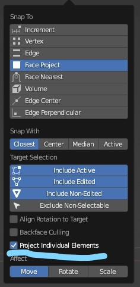 |


- ( Project Individual Elements ) allows nearby vertices to also conform to the surface below.  
This acts like a radius falloff. Very important to activate.

|**Snapping**| Hot Keys | |
|------------|---|---|
| Over Background | RMB |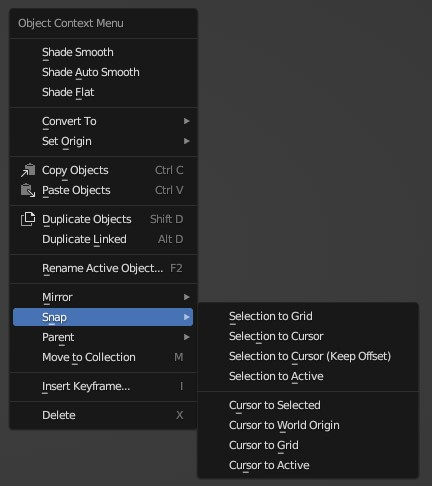|

<p></p>

**Deformation with Snapping Activated**  
Deform the Icing to adhere to the faces of the donut.
<style>
  video {
    width: 100%;
  }
</style>
 
<video controls>
<source src='https://www.dropbox.com/s/kmc9unpb7nh8r50/04-A_Snap-Projected.mp4?raw=1'>
</video>

<p></p>

When wire frames do not appear as expected, when can go to Edit mode, toggle keys [ 1, 2, 3 ]  
We can also toggle the ( Display Modifier in Edit Mode ) button.

<style>
  video {
    width: 100%;
  }
</style>
 
<video controls>
<source src='https://www.dropbox.com/s/5bxq8bdhhvza3rl/04-E2_Wireframe-Toggle.mp4?raw=1'>
</video>
<p></p>

---

```{admonition} Select through MESH error
:class: warning

When selecting a vertex, it is possible to select points on the backside.  
Shift + Z for X-Ray, or Z + Swipe Left to see that no other points are selected.
```  

[ Select Through Bug in Blender ](https://youtu.be/R1isb0x4zYw?list=PLjEaoINr3zgFX8ZsChQVQsuDSjEqdWMAD&t=557)

---

### Fixing Mesh Occlusion

The mesh for the icing will be occluded by the base.  
So we pull the mesh forward by activating Snap, Proportional Editing and pressing 'G'   
then drop the selection.
<p></p>

| Command | Hot Key     | note |
| ------- | ------------|-----|
| Activate Snapping | Ctrl + TAB |
| Activate Proportional Falloff | O | |
| Move | G |
| Drop Selection | [Esc, LMB ] | Drop Selection without moving vertexes. |
| Repeat Where Needed |||

<p></p>

<style>
  video {
    width: 100%;
  }
</style>
 
<video controls>
<source src='https://www.dropbox.com/s/u7jtarq084wuysd/04-E3_Bring-Mesh-Through.mp4?raw=1'>
</video>
<p></p>

[Donut Tutorial: Pull Mesh Forward ](https://youtu.be/R1isb0x4zYw?list=PLjEaoINr3zgFX8ZsChQVQsuDSjEqdWMAD&t=512)

---

### Camera Repositioning

Here we re-position the camera for a render. 

<style>
  video {
    width: 100%;
  }
</style>
 
<video controls>
<source src='https://www.dropbox.com/s/oqb2ef4v49aio4j/04-C_Camera-Movement-Practice.mp4?raw=1'>
</video>

<style>
  video {
    width: 100%;
  }
</style>
The method above involves using 'G' to manipulate the camera.  
<p></p>
Instead, we can easily manipulate the camera from the viewport.
<p></p> 

 **Simple Way to Frame a Shot**

| Command | Hot Key     | note |
| ------- | ------------|-----|
| Side Menu  | N |
| Select | View |
| Checkbox   | Activate 'Camera to View' |
| Choose the Camera Frame | Pan, Rotate, Zoom | Normal navigation |
| Deselect 'Camera to View' | | Or leave on and press Numpad '0' to exit |


**Cons**: Typically we can leave the camera view by pressing the MMB to escape, now we need to press 'Num pad 0' or uncheck 'Camera to View'.  
MMB Scroll to Zoom in and out does not allow for using 'Shift' for smooth increments. 


### Render Visibility

<div class="admonition note" name="html-admonition" style="background: lightyellow; padding: 10px">
<p class="title"> </p>
We observe that we are accidently rendering the original cube placed our scene and not our current view. 
</div>

<video controls>
<source src='https://www.dropbox.com/s/0p6gxxu5n28abil/04-D_Render-Not-Visibility-Dependent.mp4?raw=1'>
</video>
<p></p>

```{note} 
:class: warning
A layer can be invisible in the viewport but will still appear in the render.
```    
---

### References

:::{card}

"_I want to get a T-Shirt that says, 'Reference, Reference, References'.. It is my biggest piece of advice for artists whenever they ask for feedback._" 
\- Blender Guru
:::

<style>
  video {
    width: 100%;
  }
</style>
 
 It is critical to switch to **Object** mode to enable the Add > Image > Reference option.

| Actions |  Hot Key    | 
| ------- | ------------|
| Switch to Object | [ Tab, Pie: Ctrl + Tab ] |
| Add Image to Current Viewport | Shift + A |
|  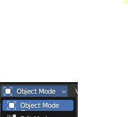  |  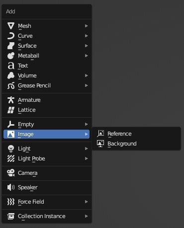 |


<video controls>
<source src='https://www.dropbox.com/s/tk4186vkm96qg85/04-E_Switch-to-Object-Mode-for-References.mp4?raw=1'>
</video>

<p>  </p>

Here we show three different ways of adding references.

<style>
  video {
    width: 100%;
  }
</style>
 
<video controls>
<source src='https://www.dropbox.com/s/hi75ve7i1l9g6dm/04-F_Add-References-3-Ways.mp4?raw=1'>
</video>
 
<p></p>

- | **Add > Image > Background** | is best used when in Front, Top, or Right viewports.  
- The background image is only visible from the chosen viewport. 
- | **Add > Image > Reference** | projects an image onto a plane (card) from the current view. 
- Add [ Reference, Background ] are identical if performed from the perspective or camera views. 

---

### Apply Subdivisions

Here we add additional detail by applying the Subdivision surface.

```{admonition} Apply Subdivison Surface
:class: warning 

<style>
  video {
    width: 100%;
  }
</style>
 
<video controls>
<source src='https://www.dropbox.com/s/f4gpunxxhwhtdcc/04-G_Apply-Subdivision.mp4?raw=1'>
</video>
<center> Place Subdivision Modifier at top of Stack and Apply 
 
```

 - Moves Edges and Apply Second Sub Division Modifier.

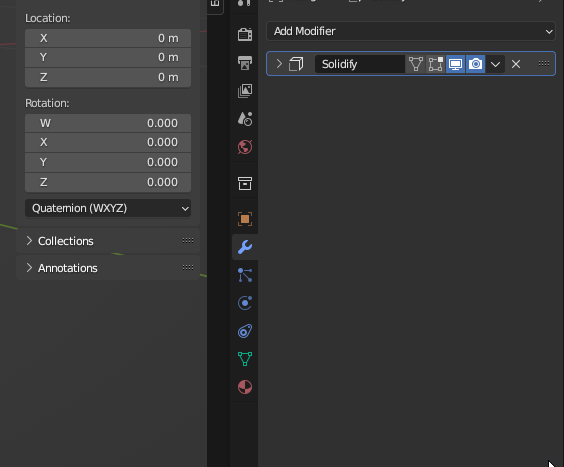

---

### Extrude Edges

Make drips by extruding.

  | Command | Hot Key     | note |
  | ------- | ------------|-----|
  |  Extrude |  E | Edit Mode |
<style>
  video {
    width: 100%;
  }
</style>
 
<video controls>
<source src='https://www.dropbox.com/s/3e3xf8llqrwfj6z/04-H_Extrude.mp4?raw=1'>
</video>
<p></p>

### Select Edges

Shrink the middle of the donut.

| Command | Hot Key     | note |
| ------- | ------------|-----|
| Select Edges | Alt + LMB | Edit Mode [ Vertices, Edges, Faces ] |
| Contract Edge | Alt + S | Scale Along Normals |

<style>
  video {
    width: 100%;
  }
</style>
 
<video controls>
<source src='https://www.dropbox.com/s/1jw0zka24uhvjvm/04-I_Select-Edges.mp4?raw=1'>
</video>
<p></p>

### Shrink Wrap Modifier

This is a second way to match the icing to the Donut.

| Command | Hot Key     | note |
| ------- | ------------|-----|
| Shrink Wrap  | Modifier | Use Eye Dropper to Pick Target |
| Move Modifier to top of Stack | |

<style>
  video {
    width: 100%;
  }
</style>
 
<video controls>
<source src='https://www.dropbox.com/s/g331i8pdh7j2h2b/04-J_Shrink-Wrap.mp4?raw=1'>
</video>
<p></p>

[Blender Tutorial Part 4: Shrinkwrap Modifier.](https://youtu.be/R1isb0x4zYw?t=920)

---

%% Part 05 -----------------------------------------------------------------------

## Part 05: Sculpting

Adding greater details to our icing.

```{admonition} Warning
:class: warning

Save scene before applying modifiers.

```

- Apply Modifiers from top down before we begin sculpting.  
<p></p>

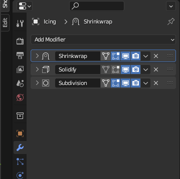

---

### Draw 

Select the Layout Sculpting Mode Tab.


| Command | Hot Key     | note |
| ------- | ------------|-----|
| Sculpting | Pie Menu: Ctrl + Tab [ Sculpting ] |
| Draw, Pull [ Push ] |  X, [ Ctrl + Drag ] ||
| Grab | G | |
| Change Radius | F | |
| Strength of Radius | Shift + F | |
| Smooth | Shift + S | Hold Shift to activate Smooth anytime |
| Inflate | I | Ctrl to Deflate |
| Show All Brushes | Pop Up: Shift + Space Bar | |

<style>
  video {
    width: 100%;
  }
</style>
 
<video controls>
<source src='https://www.dropbox.com/s/ist7xjekdq7o8u1/05-C_Draw.mp4?raw=1'>
</video>
<p></p>

---

### Inflate > Stroke > Airbrush

:::{card} Inflate > Stroke > Option 'Space'
- With Airbrush activated, we do not need to move the mouse to inflate the mesh.
- Observe that the 'Active Tool' option is identical to our 'N' Slide panel.
- 'Space' is the default setting which applies inflation upon cursor movement.
:::

<style>
  video {
    width: 100%;
  }
</style>
 
<video controls>
<source src='https://www.dropbox.com/s/ewjs12nxw0wl5lr/05-D_Inflate-Air-Brush.mp4?raw=1'>
</video>
<p></p>

<p></p>

### Inflate > Stroke > Space

:::{card}
Inflate using Tool > Inflate > Stroke > Space
:::


<style>
  video {
    width: 100%;
  }
</style>
 
<video controls>
<source src='https://www.dropbox.com/s/s6j2py75exflas8/05-E_Inflate-Space.mp4?raw=1'>
</video>
<p></p>

---

%% PART 06 -----------------------------------------------------------------

## Part 06: Rendering

| Command | Hot Key     | note |
| ------- | ------------|-----|
| Snap Light to Center  |  Alt + G | With light selected. |


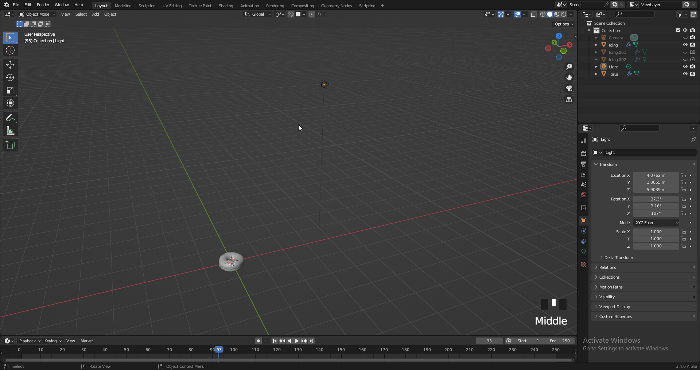
- "Clear Location"

:::{card} 
Move light up to 3/4 Position.
:::

<style>
  video {
    width: 100%;
  }
</style>
 
<video controls>
<source src='https://www.dropbox.com/s/x9j5l8n7kthrn12/06-A2_Position-Light.mp4?raw=1'>
</video>
<p></p>

:::{card} 
Reduce Lighting Power to 20.2W
:::

<style>
  video {
    width: 100%;
  }
</style>
 
<video controls>
<source src='https://www.dropbox.com/s/bos43k2pwchy70q/06-B_Reduce-Lighting.mp4?raw=1'>
</video>
<p></p>

| Command | Hot Key     | note |
| ------- | ------------|-----|
| Switch Rendered Mode |Z |  |


| Rendered | Materials | Solid | Wireframe |
| ------- | ------------|-----| --- |

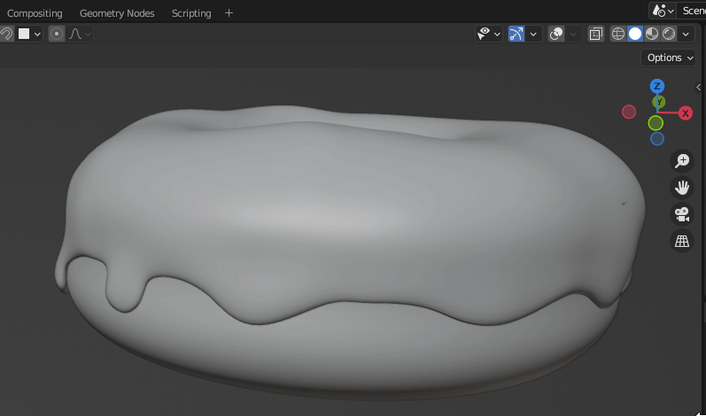

---

### Change Viewport Display

::::{Tip}
Reduce the size of the camera in the viewport.  
Does not work for lights.
:::: 

<style>
  video {
    width: 100%;
  }
</style>
 
<video controls>
<source src='https://www.dropbox.com/s/vb9gheq274raihz/06-C_Change-Camera-Display.mp4?raw=1'>
</video>
<p></p>

---

### Render Engines (EeVee, Cycles)

:::{card} Render Engines
EeVee is the render engine that ships with Blender. Suitable for games. Cycles is Ray Tracer.
:::

::::{card} Choose Render Engine
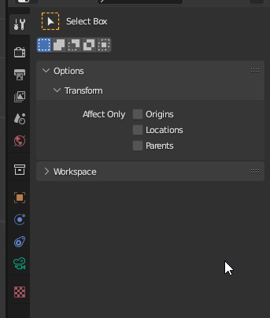
::::

:::{card} Increase Shadows
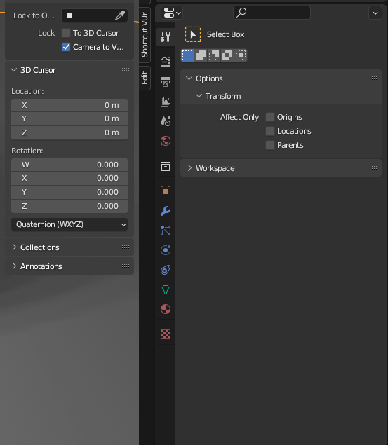
:::

:::{card} Select Light, Reduce Shadow Bias
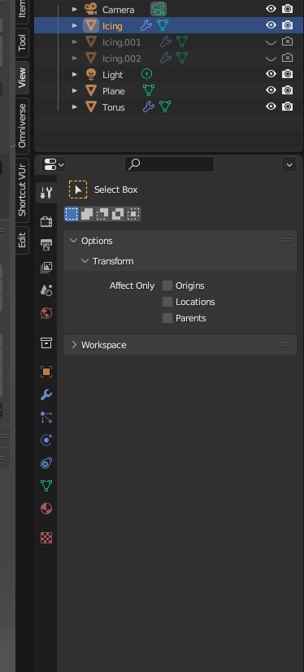
:::

:::{card} (Optional) Add Contact Shadows, depending on the scene
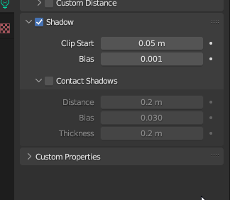
:::

:::{card} Add Ambient Occlusion
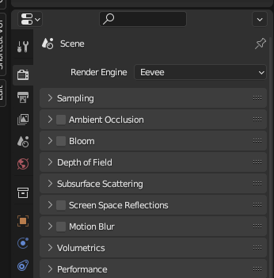
:::

:::{card} Activate Screen Space Reflections
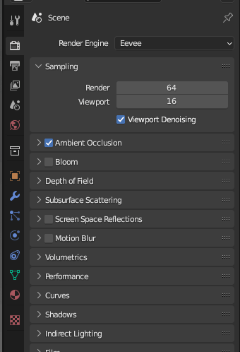
:::

- One can also add 'Bloom' for a bit of glare.

<p></p>

[Blender Guru: Part 06, Rendering - Eevee](https://youtu.be/_WRUW_fs1g8?t=616)


---

### Add Hardware Acceleration (GPU)

:::{card} Add GPU's
{root file menu }  
Edit > Preferences > System > Optix.  
Use CUDA if Optix is n/a.
:::

<style>
  video {
    width: 100%;
  }
</style>
 
<video controls>
<source src='https://www.dropbox.com/s/28bmtnwvc4pv7zf/06-E_Add-GPU.mp4?raw=1'>
</video>
<p></p>

----

### Render to Slots

Slots act as Snapshots so we can flip through our renders.

| Command | Hot Key     | note |
| ------- | ------------|-----|
| View Slots  |  [ 1, 2, 3, 4, 5.. ] |


<style>
  video {
    width: 100%;
  }
</style>
 
<video controls>
<source src='https://www.dropbox.com/s/q5tzl3nifxljt5t/06-F_Render-Slots.mp4?raw=1'>
</video>
<p></p>

---

### Materials

| Command | Hot Key     | note |
| ------- | ------------|-----|
| Select Object | LMB | Object Mode |
| Choose Material | Select Icon| |
| Choose New | Select | Principled BSDF |

<style>
  video {
    width: 100%;
  }
</style>
 
<video controls>
<source src='https://www.dropbox.com/s/o391tmlv75unb3m/06-H_Materials.mp4?raw=1'>
</video>
<p></p>

:::{card} Add Colors 
- Add Colors to the Icing.  
- Adjust the Roughness to 0.150  
- Add Color to Donut.  
- Add Color to Plane. 
:::

<style>
  video {
    width: 100%;
  }
</style>
 
<video controls>
<source src='https://www.dropbox.com/s/x5ztwgy335q5r6d/06-H4_Base-Color.mp4?raw=1'>
</video>
<p></p>

---

### Subsurface Scattering

:::{card} Subsurface Scattering.
Subsurface scattering allow objects to have a transluceny or an apparent internal glow to themselves.
:::

| Command | Value     | note |
| ------- | ------------|-----|
|  Subsurface  | 0.100 | |
| Subsurface Radius | 0.002 | Select all three by dragging down |
| Subsurface Color | Base Color + 0.8 Saturation  | Drag Base Color to slot |

<style>
  video {
    width: 100%;
  }
</style>
 
<video controls>
<source src='https://www.dropbox.com/s/w542hlhlk91ml1x/06-H5_Subsurface.mp4?raw=1'>
</video>
<p></p>

| Command | Hot Key     | note: Drag Color Swatch to Target |
| ------- | ------------|-----|
| **Smart Copy** | Shift Select | 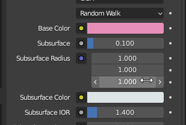 |

---

### Material Preview to EeVee

:::{card} Make Material Setting Equivalent to EeVee.
By Selecting Scene Lights and Scene World we can access EeVee through 'Z' Pie Menu.
:::

<p></p>

<style>
  video {
    width: 100%;
  }
</style>
 
<video controls>
<source src='https://www.dropbox.com/s/v24kilj1s3949nv/06-H6_EeVee-As-Hotkey.mp4?raw=1'>
</video>
<p></p>

---

### Samples and Noise

::::{important} 
More samples reduces noise but increases render times.
::::

| Label | Value     | note |
| ------- | ------------|-----|
| Samples | Set [ 100, 200 ] | These are recommended samples for this size scene. |

:::{card} Exploring Samples.
- Sampling is available under render engine 'Cycles' but not 'EeVee'.
- Viewport and Render have separate Samples and Noise attributes.
:::

<p></p>

<style>
  video {
    width: 100%;
  }
</style>
 
<video controls>
<source src='https://www.dropbox.com/s/fq78e5fpb832uqx/06-I_Samples-Noise.mp4?raw=1'>
</video>
<p></p>

```{note} 
:class: warning
- Denoise for Render Defaults to CPU, not GPU.
- We leave the noise threshold at it default value.
```
---

## Part 07: Texturing & Shading

[Blender Guru - Texture](https://youtu.be/CmrAv8TSAao)

```{note} Recommendation: 
:class: warning
[PureRef](https://www.pureref.com/) is the standard tool for collecting reference photos.
```

<div class="admonition note" name="html-admonition" style="background: lightgreen; padding: 10px">
<p class="title"> </p>
</div>

:::{card} Textures.
"_Real Donuts are not one solid color._"  
"_Base color, roughness value and normal map (bump mapping) - 90% of the materials you make will just use those three things." -Blender Guru_
:::

<div class="admonition note" name="html-admonition" style="background: lightgreen; padding: 10px">
<p class="title"> </p>
</div>

### Node Editor 

 | Command | Hot Key     | note |
 | ------- | ------------|-----|
 | Add Node | Shift + A | Equivalent to 'Add Mesh' |
 | Cut Noodle | Ctrl + RMB | 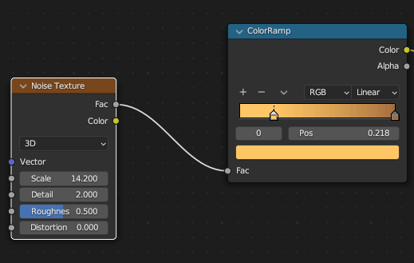 |
 | Lift Node | Ctrl + X | 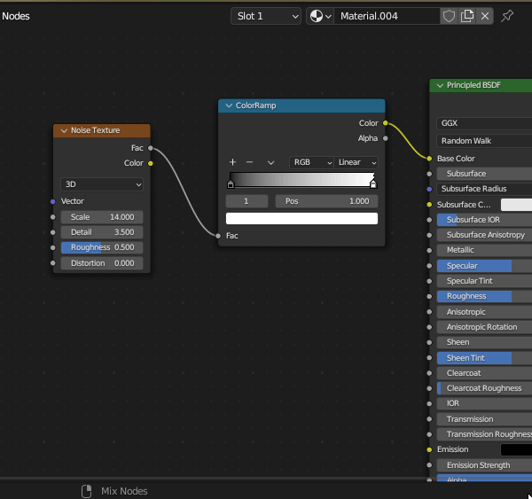|

---

```{note} 
:class: warning
Noise is one of the most commonly used Material nodes.

```

| Actions | Adjustments     | note |
| ------- | ------------|-----|
| Add Noise Node | Connect 'Fac' to Base Color |
| Adjust Parameters |Set Scale ~ 15.0  | Detail ~ 3.5 |


<p></p>
 
<style>
  video {
    width: 100%;
  }
</style>
 
<video controls>
<source src='https://www.dropbox.com/s/vmgffzrnc3da1pe/07-A_Node-Editor.mp4?raw=1'>
</video>
<p></p>


--- 

| Command | Hot Key     | note |
| ------- | ------------|-----|
| Add Color Ramp | Adjust Scale of Ramp ||
 
<p></p>
 
<style>
  video {
    width: 100%;
  }
</style>
 
<video controls>
<source src='https://www.dropbox.com/s/hploisedsrq0mtx/07-D2_Add_Color-Ramp.mp4?raw=1'>
</video>
<p></p>

 
<p></p>
 
<style>
  video {
    width: 100%;
  }
</style>
 
<video controls>
<source src='https://www.dropbox.com/s/q6bt27psyt2dn8v/07-D3_Add_Color_Ramp_Vertical.mp4?raw=1'>
</video>
<p></p>

%%

---

::::{Important} Add Node Wrangler 
This allow us to isolate nodes and preview them.

<p></p>
 
<style>
  video {
    width: 100%;
  }
</style>
 
<video controls>
<source src='https://www.dropbox.com/s/uffgn5n1yednulv/07-B_Add-On-Node-Wrangler.mp4?raw=1'>
</video>
<p></p>

::::


| Command | Hot Key     | note |
| ------- | ------------|-----|
| Preview Node | Ctrl + Shift + Select | Node Wrangler |

 --- 

| Command | Purpose   | note |
| ------- | ------------|-----|
| Add Texture Coordinate Node | Avoids Distortion in Center | Use Object Connector |

<p></p>
 
 Overview (with checker node added )

<style>
  video {
    width: 100%;
  }
</style>
 
<video controls>
<source src='https://www.dropbox.com/s/ca09zdytb8pgxe9/07-C_Texture-Coordinate.mp4?raw=1'>
</video>
<p></p>

Close Up
 
<p></p>
 
<style>
  video {
    width: 100%;
  }
</style>
 
<video controls>
<source src='https://www.dropbox.com/s/83flxa5hqf80hu9/07-E_Texture-Coordinate_Vertical.mp4?raw=1'>
</video>
<p></p>

::::{important} 

With our noodles, we typically connect like color connectors to other like colors, except for gray and yellow, which can be mixed

::::


| Command |  
| ------- | 
| Adjust: Scale, Detail  | 


<div class="admonition note" name="html-admonition" style="background: lightgreen; padding: 10px">
<p class="title"> </p>

</div>

---

### Bump Map

| Command |  
| ------- | 
| Add Vector > Normal Map  | 

 
<p></p>
 
<style>
  video {
    width: 100%;
  }
</style>
 
<video controls>
<source src='https://www.dropbox.com/s/5ttm3f5xh6a8g3l/07-F_Add-Normal.mp4?raw=1'>
</video>
<p> </p
<p></p>

---

Steps: 

| Command |  |
| ------- | ---- |
|Shift + A | Add Vector > Normal Map  | 
 
<p></p>
 
<style>
  video {
    width: 100%;
  }
</style>
 
<video controls>
<source src='https://www.dropbox.com/s/wuu2devi5wroe9l/07-F_Add-Normal_Vertical.mp4?raw=1'>
</video>
<p></p>


| Action | Value |
| ------- |------ |
| Adjust Distance | 1.00 -> 0.002 |

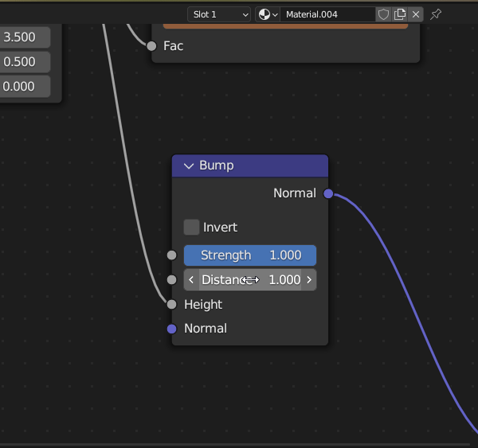

::::{important} Bump Strength Should Always be 1.0
- Distance is given in Blender units, or 1 meter.
- Be sure to connect Fac -> Height.
::::

---

## Part 08: Texture Painting

| Action |  |
| ------- |------ |
| Shift + A  | Texture > Image Texture |

 
 
<p></p>
 
<style>
  video {
    width: 100%;
  }
</style>
 
<video controls>
<source src='https://www.dropbox.com/s/20e6niiksc3r8ag/08-A_Add-Image-Texture.mp4?raw=1'>
</video>
<p></p>
<p></p>

```{note} 
:class: warning
The Donut will turn purple or black to indicate that no texture has been assigned yet.
```
 
:::{card} Use Node Search:
We can add Image Texture quickly by using the Search function.

<p></p>
 
<style>
  video {
    width: 100%;
  }
</style>
 
<video controls>
<source src='https://www.dropbox.com/s/jcb7vxisex6b401/08-A2_Add-Node-Search.mp4?raw=1'>
</video>
<p></p>
<p></p>

:::

| Action | 
| ------- |
| Add Texture | 

<p></p>
 
<style>
  video {
    width: 100%;
  }
</style>
 
<video controls>
<source src='https://www.dropbox.com/s/qajh89dkigfybnk/08-B_Add_Texture.mp4?raw=0'>
</video>
<p></p>
<p></p>

:::{card} Add Texture to Paint On:
  
<p></p>
 
<style>
  video {
    width: 100%;
  }
</style>
 
<video controls>
<source src='https://www.dropbox.com/s/9y9azpumbw9ibpu/08-B_Add_Texture_Vertical.mp4?raw=0'>
</video>
<p></p>
<p></p>
:::

| Action |  | 
| ------- |------ |
| Switch Tabs > Texture Paint |
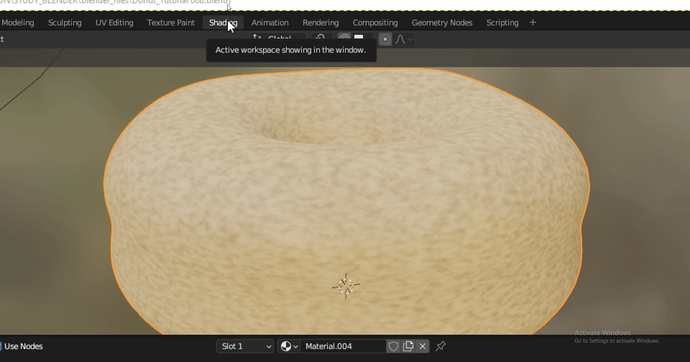


| Action | Value |
| ------- |------ |
| Change Object > Edit Mode | Allows Selections to be Made  |
| Select Paint Mode | Selections are displayed in Image Editor Window |

 
<p></p>
 
<style>
  video {
    width: 100%;
  }
</style>
 
<video controls>
<source src='https://www.dropbox.com/s/y70u0w5sh6n99g1/08-C_Texture-Selections.mp4?raw=1'>
</video>
<p></p>
<p></p>

Optional: Rearrange screen for vertical friendly viewing.

 
<p></p>
 
<style>
  video {
    width: 100%;
  }
</style>
 
<video controls>
<source src='https://www.dropbox.com/s/iqctqdh9rgq9q0x/08-B2_Screen-Swap.mp4?raw=1'>
</video>
<p></p>
<p></p>


:::{card} 2D Mapping of 3D Surface:
 
<p></p>
 
<style>
  video {
    width: 100%;
  }
</style>
 
<video controls>
<source src='https://www.dropbox.com/s/d5trge08abnbme0/08-C_Texture-Selections_Vertical.mp4?raw=1'>
</video>
<p></p>
<p></p>
:::

| Action | 
| ------- |
| Paint on Texture Image in 2d and 3d views. |

 
<p></p>
 
<style>
  video {
    width: 100%;
  }
</style>
 
<video controls>
<source src='https://www.dropbox.com/s/c276ipoxiatja6z/08-D_Paint-On-Texture.mp4?raw=1'>
</video>
<p></p>
<p></p>

:::{card} Paint on Texture
 Breakdown:
<p></p>
 
<style>
  video {
    width: 100%;
  }
</style>
 
<video controls>
<source src='https://www.dropbox.com/s/ade7mgr1by1xcsq/08-D_Paint-On-Texture_Vertical.mp4?raw=1'>
</video>
<p></p>
<p></p>
:::

---

::::{important} Draw Icon
Be sure to click on the Draw / Paint icon (top left) in order to bring up the paint swatches.
::::

```{warning} 
:class: warning

- Save the *image Texture File or it will be **Erased**.
- On exit, Blender will offer a chance to save the file.
```
| Action | 
| ------- |
| Save Texture (*image) file: |  
  
 <p></p>
  
 <style>
   video {
     width: 100%;
   }
 </style>
  
 <video controls>
 <source src='https://www.dropbox.com/s/q7w7kwuzb0mqxlc/08-D2_Save-Texure.mp4?raw=1'>
 </video>
 <p></p>
 <p></p>


:::{card} 
Save *Image of Texture file.
<p></p>
 
<style>
  video {
    width: 100%;
  }
</style>
 
<video controls>
<source src='https://www.dropbox.com/s/ds0tsc50aahy177/08-D2_Save-Texure_Vertical.mp4?raw=1'>
</video>
<p></p>
<p></p>

:::

```{note} 
:class: warning
- Overlay brightens and darkens the texture underneath it (increased contrast)
- Multiply uses the dark in the layer below.
- Add is the opposite of multiply.
```

| Action | note |
| ------- |------ |
| Delete Color Ramp | We will no longer need this node. |

 
<p></p>
 
<style>
  video {
    width: 100%;
  }
</style>
 
<video controls>
<source src='https://www.dropbox.com/s/wiaoas2lvad30wu/08-D3_Delete-Color-Ramp.mp4?raw=1'>
</video>
<p></p>
<p></p>

```{warning} 
:class: warning
Search will not find 'Mix Color' Node.
```

| Action | Value |
| ------- |------ |
| Add Mix Color Node | User Defined Blue and Red  |

<p></p>
 
<style>
  video {
    width: 100%;
  }
</style>
 
<video controls>
<source src='https://www.dropbox.com/s/vgvjg4uzsdp35fg/08-E_Add-Mix-Node.mp4?raw=1'>
</video>
<p></p>
<p></p>


:::{card} 
 Vertical Mode:
<p></p>
 
<style>
  video {
    width: 100%;
  }
</style>
 
<video controls>
<source src='https://www.dropbox.com/s/jnqp9p7uxdn99hs/08-E_Add-Mix-Node_Vertical.mp4?raw=1'>
</video>
<p></p>
<p></p>
:::

:::{card} Connect and Adjust **Mix Color** Node

| Action | Value |
| ------- |------ |
| Connect A | From Donut Base Color |
| Connect B | From Fac (Factor) of Noise |
| Switch **Mix** | **Overlay**|
| Adjust Noise Texture | Scale: ~7.0 or to one's liking |
| Adjust Mix Color | Fac: ~ 0.67 or to one's liking |

:::

 
<p></p>
 
<style>
  video {
    width: 100%;
  }
</style>
 
<video controls>
<source src='https://www.dropbox.com/s/x5h43wvj5n7a6rs/08-F_Connect-Mix-Node.mp4?raw=1'>
</video>
<p></p>
<p></p>

:::{card} Vertical - Breakdown
 
<p></p>
 
<style>
  video {
    width: 100%;
  }
</style>
 
<video controls>
<source src='https://www.dropbox.com/s/1s8v2v8p8hy4u6w/08-F_Connect-Mix-Node_Vertical.mp4?raw=1'>
</video>
<p></p>
<p></p>
:::

---

## Part 09: Geometry Nodes

[Blender Guru: Part 09](https://youtu.be/4WAxMI1QJMQ)

| Command | Action |
| ------- |------ |
| Review our Changes from Part 08 | M (mute node) |
| Turn on Plane, Lights, Icing | Click on Eyeball in Outliner, Select Icing |
| Create a New Tab Geometry Node Tab | + Menu > Geometry Node |
| Close Spreadsheet Window | RMB Over Panel > Join / Cross Hair from Left Corner |
| Create First Geometry Node | Click '+ New' |
| Toggle Visibility | Select and Deselect Geometry Node in Modifier Stack |
| Make Visibility Independant of Selection in Stack | Select Pin |

 <p></p>
 
<style>
  video {
    width: 100%;
  }
</style>
 
<video controls>
<source src='https://www.dropbox.com/s/zf286s3uvamhx15/09-A_Add-Geometry-Node.mp4?raw=1'>
</video>
<p></p>
<p></p>

:::{card} Vertical View
 
<p></p>
 
<style>
  video {
    width: 100%;
  }
</style>
 
<video controls>
<source src='https://www.dropbox.com/s/skwun3dsf61jemd/09-A_Add-Geometry-Node_Vertical.mp4?raw=1'>
</video>
<p></p>
<p></p>
:::

---

| Command | Combination     | note |
| ------- | ------------|-----|
| Split Screens with Cross Hairs | From a Corner, Drag a Window onto itself to split | 
| Join Screens with Cross Hairs  | Drag a Corner onto Adjacent window to merge |
 
<p></p>
 
<style>
  video {
    width: 100%;
  }
</style>
 
<video controls>
<source src='https://www.dropbox.com/s/6ixwfo6h1n10l6k/Window-Splitting.mp4?raw=1'>
</video>
<p></p>
<p></p>

---

| Command | Action | Value |
| ------- |------ |----|
| Set Position | Shift + A, Search > Set Position | Shif + Drag on Z |

<p></p>
 
<style>
  video {
    width: 100%;
  }
</style>
 
<video controls>
<source src='https://www.dropbox.com/s/exxob67q6t28021/09-B_Add-Set-Position.mp4?raw=1'>
</video>
<p></p>
<p></p>


:::{card} Vertical View:
 
<p></p>
 
<style>
  video {
    width: 100%;
  }
</style>
 
<video controls>
<source src='https://www.dropbox.com/s/60yawi1s4y4p3e3/09-B_Add-Set-Position_Vertical.mp4?raw=1'>
</video>
<p></p>
<p></p>

:::

| Command | Action |Value |
| ------- |------ |-----|
| Add Point to Faces | Shift + A > Point > Point on Faces  | Set to 500 |
||| Set to Zero |

 
<p></p>
 
<style>
  video {
    width: 100%;
  }
</style>
 
<video controls>
<source src='https://www.dropbox.com/s/rzkwiaegq3uqp6n/09-C_Add-Point-On-Faces.mp4?raw=1'>
</video>
<p></p>
<p></p>

:::{card} Vertical View:
 
<p></p>
 
<style>
  video {
    width: 100%;
  }
</style>
 
<video controls>
<source src='https://www.dropbox.com/s/bgvtmqgm7latu67/09-C_Add-Point-On-Faces_Vertical.mp4?raw=1'>
</video>
<p></p>
<p></p>

:::
```{note} Observe:
:class: warning
- The icing layer has been turned into points. 
- To preserve the layer and also have points we need a 'Join Geometry Node.'
```

| Command | Action |Value |
| ------- |------ |-----|
| Preserve Icing Layer | Add (Shift + A) > Geometry > | Join Geometry  |

 
<p></p>
 
<style>
  video {
    width: 100%;
  }
</style>
 
<video controls>
<source src='https://www.dropbox.com/s/dzrht1b6f7s4wrn/09-D_Join-Geometry.mp4?raw=1'>
</video>
<p></p>
<p></p>

:::{card} Vertical Breakdown of Set Position:
 
<p></p>
 
<style>
  video {
    width: 100%;
  }
</style>
 
<video controls>
<source src='https://www.dropbox.com/s/6zbbq5olkg7k4l9/09-D_Join-Geometry_Vertical.mp4?raw=1'>
</video>
<p></p>

<p></p>

:::

---

- **Create a Single Sprinkle to Reference.**

| Command | Action |Value |
| ------- |------ |-----|
| Add Cylinder | Add > Mesh > Cylinder  | 
| Reduce Vertices | Vertices | 32 to 8 |
| Scale Down | Properties or f9 | Radius: 0.001 m |
| Move to Side | G (Grab tool) | Numpad Keys 7, 1 for Top and Front |
| Scale Z | S + Z ||
| Scale Overall | S ||

<p></p>

 
<p></p>
 
<style>
  video {
    width: 100%;
  }
</style>
 
<video controls>
<source src='https://www.dropbox.com/s/ukqkssmbtj0y0w8/09-F_Add-Sprinkle.mp4?raw=1'>
</video>
<p></p>
<p></p>

:::{card} 
 
<p></p>
 
<style>
  video {
    width: 100%;
  }
</style>
 
<video controls>
<source src='https://www.dropbox.com/s/0eagletskat3qyi/09-F_Add-Sprinkle_Vertical.mp4?raw=1'>
</video>
<p></p>
<p></p>
:::

---

| Command |   
| ------- |  
| Shift + A > Instances >  Instances on Points  |
| Drag Cylinder from Outliner to Graph |
| Connect Object Info: Geometry -> Instance |
| Apply Scale of Cylinder,  Ctrl + A Scale |
| Increase Density |


