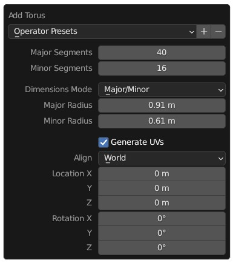

# Donut Tutorial

## Part 01

[Navigation and Hotkeys](Hotkeys.md)

#### Change Resolution Scale of Interface.
* Edit > Preferences > Interface > Resolution Scale.


---

#### Change Material Colors

Material color changes are not interactive and only show when rendered (F12).

% https://www.dropbox.com/s/d0tgmotsvrxbr4y/01_B-ChangeMaterialColors.mp4?raw=1

<style>
  video {
    width: 100%;
  }
</style>

<video controls>
  <source src="https://www.dropbox.com/s/d0tgmotsvrxbr4y/01_B-ChangeMaterialColors.mp4?raw=1" type="video/mp4">
</video>

---

```{note} **Collections** are the equivalent to Folders.
:class: warning

```  

% PART TWO--------------------------------------

## Part 02

**Object Editing**

| Command |  Hotkey      | 
| ------- | -----------   | 
|Add                 | Shift + A|
| Recall 'Operator Presets'| F9 | 

<style>
   video {
    width: 100%;
  }
</style>

<video controls>
<source src='https://www.dropbox.com/s/uqgtstm8ht4axa5/02_A-CreateTorus.mp4?raw=1'>
</video>



```{note}
:class: warning
- Having an even number seams can help when unwrapping for UV's or performing slices.  
- Odd may be helpful when trying to define the middle of an object.
```  

<style>
  video {
    width: 100%;
  }
</style>
 
 Here we learn to 'Apply Scale'.

| Command |  Hot Key   |
| ------- | -----------|
| Apply Scale | Ctrl + A  |
|Open Item Panel | N |

<video controls>
<source src='https://www.dropbox.com/s/8ky3l3e0t0lf6mp/02_B-Apply-Scale.mp4?raw=1'>
</video>

Here we scale the donut down from 3m to ~ 9 cm. 
The scale should always be near to 1, 1, 1. 


[Blender Guru: Tutorial 02, Apply Scale](https://youtu.be/imdYIdv8F4w?t=454)

We can change the shading of our object by **Selecting** the object and right clicking over the background.  
"Smooth shade is an illusion. It does not add any geometry."

 | Mouse |  Smooth Shade      |
 | ------- | -----------   | 
 |**RMB over background** | |


### Camera Lessons

| Command | Hot Key   |note|
| ------- |-----      |---|
|1. Look Thru Camera| Numpad - 0   | toggles between camera and perspective view |

<style>
  video {
    width: 100%;
  }
</style>
 
<video controls>
<source src='https://www.dropbox.com/s/537qup8eaq9e2t7/02-E_Camera-Look-Through.mp4?raw=1'>
</video>

---

| Command | Hot Key     | note |
| ------- | ---------- |----  |
| 3. Select Donut| |
| 4. Frame Selection | Press Numpad - Period ' . ' |
| 5. Move Camera to Perspective View  | Ctrl + Alt + Numpad - 0 | _**Extremely Useful Hot Key**_ |


<style>
  video {
    width: 100%;
  }
</style>
 
<video controls>
<source src='https://www.dropbox.com/s/cs84e7iomn36d1c/02-Eb_Camera-Ctrl-Alt-Num-0.mp4?raw=1'>
</video>

The camera snaps to the donut's position. 

---

| Command | Hot Key   |note|
| ------- |-----      |---|
| **Move Camera Back** |    |
| 6. Select Camera Frame |    | Notice in right hand view, camera turns orange |
| 7. Activate Grab Tool | G |
| 8. Enter Smooth Zoom Mode  | Depress MMB | In perspective view, we hold Ctrl + MMB to smooth Zoom |

<style>
  video {
    width: 100%;
  }
</style>
 
<video controls>
<source src='https://www.dropbox.com/s/kach3hb5jypsj2i/02-Eb-ii_Camera-G-MMB-Drag-to-Zoom.mp4?raw=1'>
</video>

---

<style>
  video {
    width: 100%;
  }
</style>
 
<video controls>
<source src='https://www.dropbox.com/s/gzk0t3d25l4f7d1/02-Ec_Camera-G-Drag-to-Move.mp4?raw=1'>
</video>