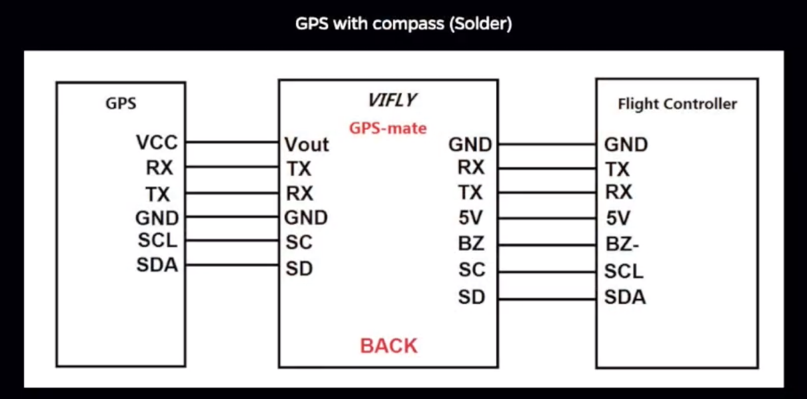

%% Pallete: [ red: #FFADAD, Orange: #FFD6A5, Yellow: #FDFFB6, Green: #CAFFBF, Aqua: #9BF6FF, Mild Blue: #A0C4FF, Purple Blue: #BDB2FF, Purple Pink: #FFC6FF, White: #FFFFFC ]

# Tag for fixing csp problem on page, but doesn't work to make yt embeds available in the page
#<meta http-equiv="Content-Security-Policy" content="frame-src 'self' *.youtube.com *.youtube-nocookie.com;">

# AI
## CLASSIFICATION

---

 

### CAR CLASSIFIER
Tag: #Edge Impulse, #Omniverse, #@DavidT

[edge-impulse.gitbook.io](https://edge-impulse.gitbook.io/docs/integrations/nvidia-omniverse#installing-the-edge-impulse-omniverse-extension) | 
[edge-impulse replicator](https://docs.edgeimpulse.com/experts/image-projects/nvidia-omniverse-replicator)
    

# HARDWARE

---

## FLIGHT CONTROLLERS
### Betaflight
### INav

- GPS and Compass Setup
[https://github.com/iNavFlight/inav/wiki/GPS-and-Compass-setup](https://github.com/iNavFlight/inav/wiki/GPS-and-Compass-setup)

---

### CLI

---

:::{card}

#### Diff

tag: #diff, #dump, #Painless360
<iframe width="560" height="315" src="https://www.youtube.com/embed/3aQNMNSAfkk?si=BD472r2GyQUnUF_m" title="YouTube video player" frameborder="0" allow="accelerometer; autoplay; clipboard-write; encrypted-media; gyroscope; picture-in-picture; web-share" referrerpolicy="strict-origin-when-cross-origin" allowfullscreen></iframe>

:::

### Ardupilot
### PX4

---

## VIDEO

### Goggles

:::{card} 

Josh Bardwell, Tutorial Build Using GogglesX  
tags: #GogglesX.

<iframe width="560" height="315" src="https://youtu.be/5PWL68Y1Fvs?t=99" title="YouTube video player" frameborder="0" allow="accelerometer; autoplay; clipboard-write; encrypted-media; gyroscope; picture-in-picture; web-share" referrerpolicy="strict-origin-when-cross-origin" allowfullscreen></iframe>

:::  

[Bardwell Tutorial Build Using Goggles X](https://youtu.be/5PWL68Y1Fvs?t=99)

%% Embed Bardwell

--

:::{card}

 

    <iframe width="560" height="315" src="https://www.youtube.com/embed/5PWL68Y1Fvs?si=PxDi2htea8MdvGBS" title="YouTube video player" frameborder="0" allow="accelerometer; autoplay; clipboard-write; encrypted-media; gyroscope; picture-in-picture; web-share" referrerpolicy="strict-origin-when-cross-origin" allowfullscreen></iframe>ß

:::

--

### Vtx (Video Tx)

## SENSORS

---

### ACCELEROMETER

---

### GYRO

---

 

 

### GPS & MAGNETOMETER

 

#### Vifly Gps Mate
[Youtube Wiring Diagram](https://youtu.be/G9SVh4PaWWg?t=387)

<iframe width="560" height="315" src="https://www.youtube.com/embed/G9SVh4PaWWg?si=VghXAUA__WJxiw5w&amp;start=391" title="YouTube video player" frameborder="0" allow="accelerometer; autoplay; clipboard-write; encrypted-media; gyroscope; picture-in-picture; web-share" referrerpolicy="strict-origin-when-cross-origin" allowfullscreen></iframe>

- GPS and Compass Setup  
[https://github.com/iNavFlight/inav/wiki/GPS-and-Compass-setup](https://github.com/iNavFlight/inav/wiki/GPS-and-Compass-setup)  
From Sensei @ Inav  

 

- How To Optimize GPS Receiver Settings in U-Center To Get More Satellite Locks  
[gps-settings-u-center](https://oscarliang.com/gps-settings-u-center/)  
Oscar Liang

:::{card} 

COMPASS ALIGNMENT  
Tags: #Painless360, Inav, Compass, FC, GPS Alignment
<iframe width="560" height="315" src="https://www.youtube-nocookie.com/embed/kVVJ-DjUjsc?si=Qc01iB4wwlFaB9Eh&amp;start=537" title="YouTube video player" frameborder="0" allow="accelerometer; autoplay; clipboard-write; encrypted-media; gyroscope; picture-in-picture; web-share" referrerpolicy="strict-origin-when-cross-origin" allowfullscreen></iframe>

:::

---

 

 

%% Pallete: [ red: #FFADAD, Orange: #FFD6A5, Yellow: #FDFFB6, Green: #CAFFBF, Aqua: #9BF6FF, Mild Blue: #A0CC4FF, Purple Blue: #BDB2FF, Purple Pink: #FFC6FF, White: #FFFFFC ]

#### Betaflight: RTH, COMPASS DENIED

- Oscar Liang
[setup-gps-rescue-mode-betaflight](https://oscarliang.com/setup-gps-rescue-mode-betaflight/)

 

 

#### Inav: RTH, COMPASS DENIED

%% Add background color.

 

:::{card} 
INAV 7.1 multi-rotor navigation without a compass  
JetrellRC  
tags: #Inav, compass, no compass.
<iframe width="560" height="315" src="https://www.youtube-nocookie.com/embed/iopZfH-DdTI?si=Qh9hk0zoNy40uyo0" title="YouTube video player" frameborder="0" allow="accelerometer; autoplay; clipboard-write; encrypted-media; gyroscope; picture-in-picture; web-share" referrerpolicy="strict-origin-when-cross-origin" allowfullscreen></iframe>
:::  
  

  

  

:::{card} 

INAV 7.1 NO COMPASS REQUIRED  
Daniel Singer
<iframe width="560" height="315" src="https://www.youtube.com/embed/UD1wbPKgR6o?si=XVrZZ2ma9GdePoEq" title="YouTube video player" frameborder="0" allow="accelerometer; autoplay; clipboard-write; encrypted-media; gyroscope; picture-in-picture; web-share" referrerpolicy="strict-origin-when-cross-origin" allowfullscreen></iframe>

:::

#### Inav: Black Box Explorer

---

### LIDAR

:::{card}

[Amazon Benewake TF-Luna LiDAR Module Range Finder Sensor Single-Point Micro Ranging Module for Arduino Pixhawk](https://www.amazon.com/Benewake-TF-Luna-Single-Point-Ranging-Interface/dp/B086MJQSLR)

:::

:::{card}

#### Diff
 

 
---

[Painless360 Diff](https://youtu.be/bEKm-PGRnks)

link

:::

### CAMERAS

:::{card} 

- Airborne remote sensing of wildland fires (PDF)  
[www.fs.usda.gov](https://www.fs.usda.gov/research/treesearch/34257)

:::

#### FPV
---
#### RECORD
---
#### IR-INFRARED

---

#### SWIR-SHORTWAVE IR

---

 

    
#### SAR - SYNTHETIC APERATURE RADAR    
    
:::{card} 

    
[What is SAR?](https://www.earthdata.nasa.gov/learn/backgrounders/what-is-sar)

[https://nisar.jpl.nasa.gov/mission/get-to-know-sar](https://nisar.jpl.nasa.gov/mission/get-to-know-sar/overview/)

:::

---

:::{card} 

 

:::

:::{card}

 

:::

:::{card}

 

:::
    

